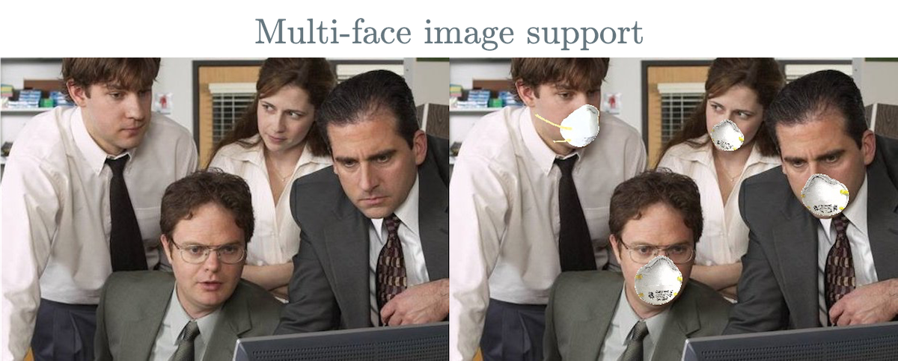

# MaskTheFace - Convert face dataset to masked dataset

## What is MaskTheFace?
MaskTheFace is computer vision based scripts to mask faces in images. It provides a number of masks to select from.  
It is difficult to collect mask dataset under various conditions. MaskTheFace can be used to convert any existing face dataset to masked-face dataset.
MaskTheFace identifies all the faces within an image, and applies the user selected masks to them taking into account various limitations such as face angle, mask fit, lighting conditions etc.  
A single image, or entire directory of images can be used as input to code.


## How to install MaskTheFace
It’s advisable to [make a new virtual environment](https://towardsdatascience.com/setting-up-python-platform-for-machine-learning-projects-cfd85682c54b) and install the dependencies. Following steps can be taken to download get started with MaskTheFace
### Clone the repository
```
git clone https://github.com/aqeelanwar/MaskTheFace.git
```

### Install required packages
The provided requirements.txt file can be used to install all the required packages. Use the following command

```
cd MaskTheFace
pip install –r requirements.txt
```

This will install the required packages in the activated python environment.

## How to run MaskTheFace

```
cd MaskTheFace
# Generic
python mask_the_face.py --path <path-to-file-or-dir> --mask_type <type-of-mask> --verbose

# Example
python mask_the_face.py --path 'data/office.jpg' --mask_type 'N95' --verbose
```

### Arguments
* __--path__: is used to provide the path of the image file or the directory containing face images.
* __--mask_type__: is used to select the mask to be applied. Available options are 'N95', 'surgical_blue', 'surgical_green', 'cloth'. More masks will be added
* __--verbose__: used to display useful messages during conversion

## Features:
### Support for both single and multi-face images:

### Wide face angle coverage

### Brightness corrected mask application

### Bulk masking on datasets


## Example usage

### Face recognition with masks
Face recognition trained to usual face images have proven to given good accuracy.
In the recent ongoing outbreak of Covid19, people have been advised to use face masks. With majority of people using face masks, the face recognition system fails to perform. Due to limited mask images, there is not enough masked data available to train a new system.MaskTheFace can be used to create masked data set from unmasked dataset which is then used to finetune the existing or train a new face recognition system.

A VGG16 network was trained on 20 different classes of VGGFace2 dataset for face recognition. The network achieved an accuracy of 68.3% on test dataset. When the same network was
tested on the masked test images gave an accuracy of only 36.6%
MaskTheFace dataset was used to generate masked images from the training dataset and was made a part of training set. The network trained this dataset
gave an accuracy of 70.7% on un-masked, while 65.5% on masked dataset.


### Monitoring if people are using masks
MaskTheFace generated datasets can be used to monitor if people are using face mask. An example of such deep network trained on MaskTheFace generated dataset can be seen below

The detector above was trained on 2000 images (1000 mask, 1000 without mask). The masked images contained 4 different types of masks. VGG16 was trained on these images which acheived a 98.9% accuracy on test dataset.

## Citation
If you find this repository useful, please use following citation